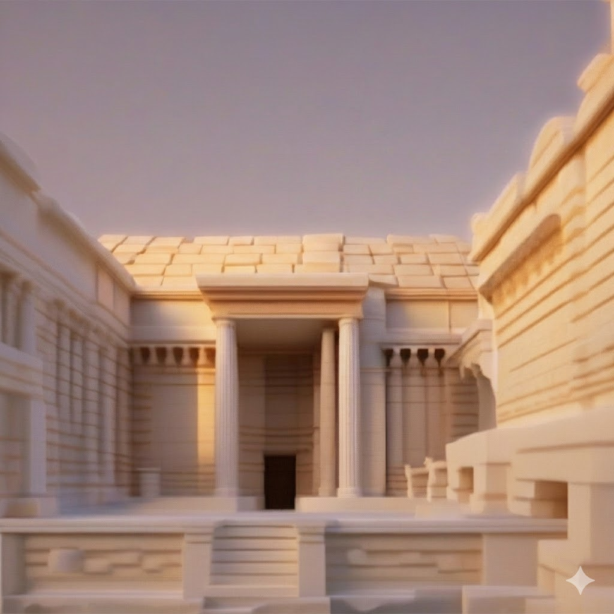
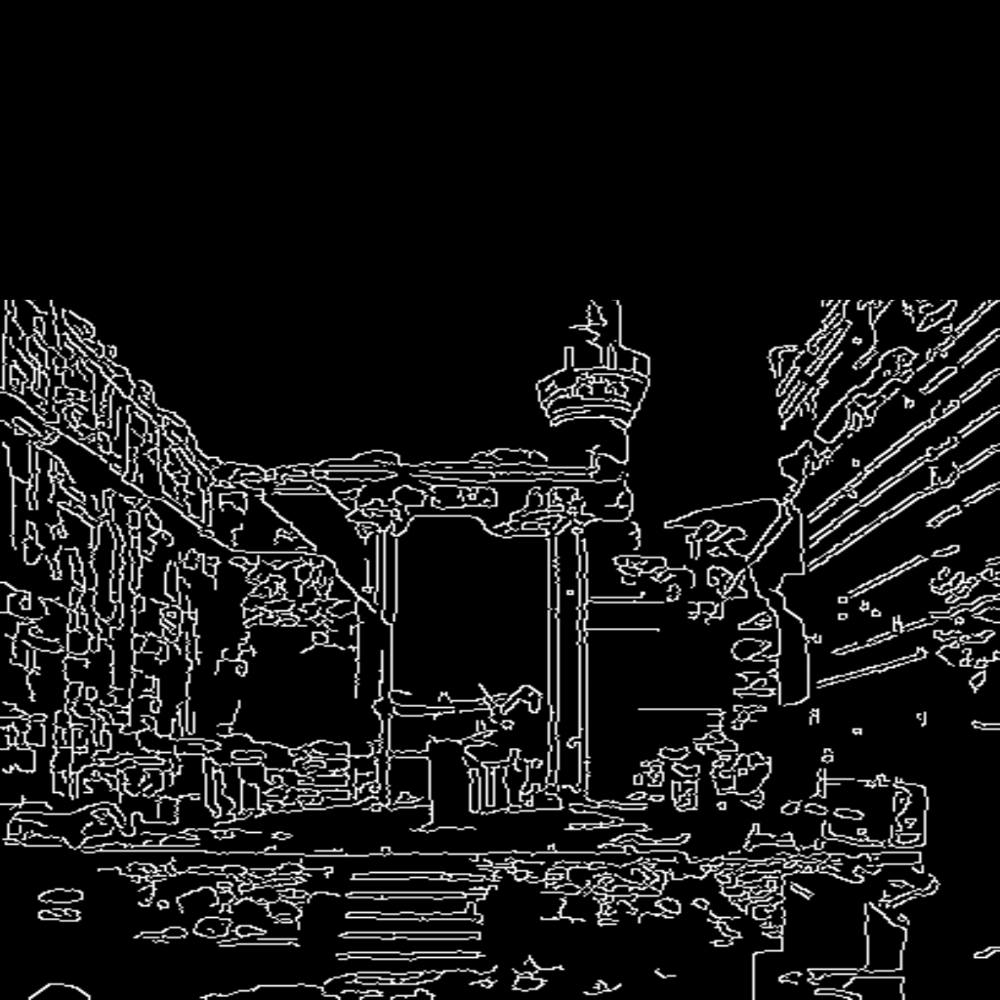
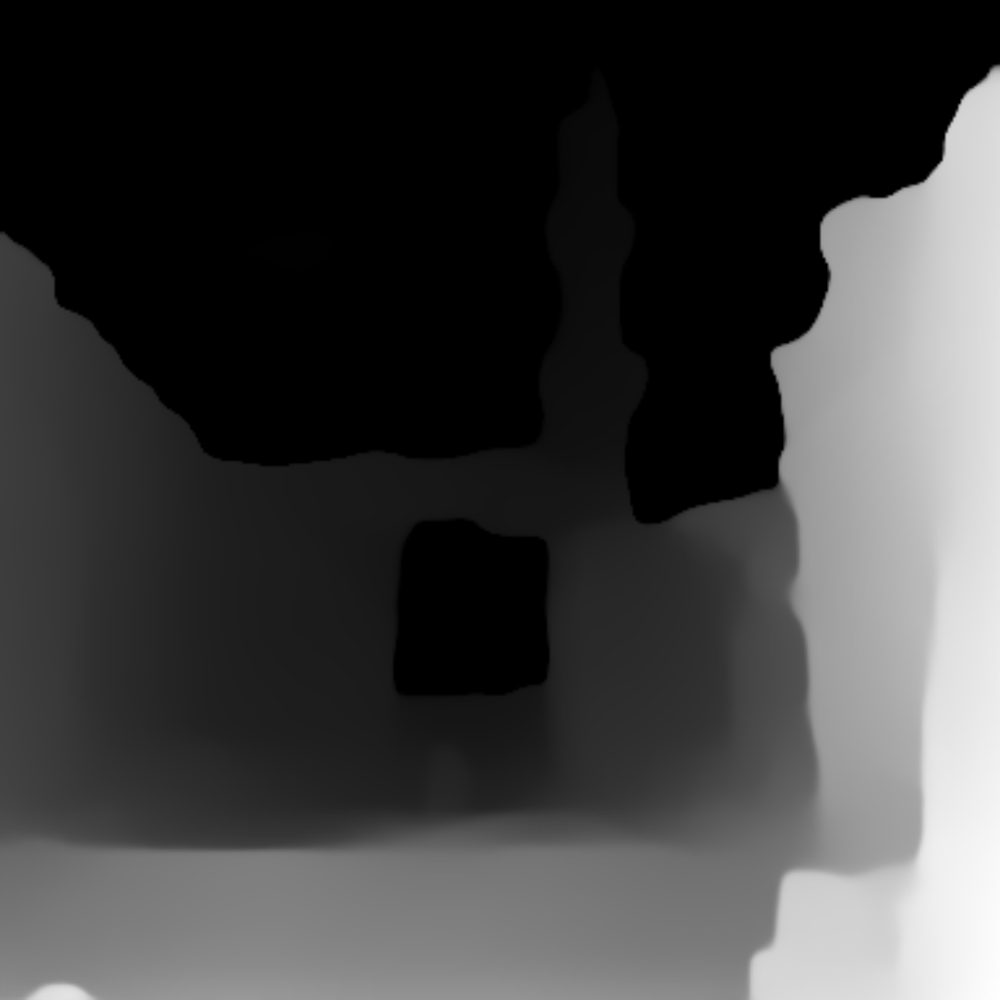

# SARS — Scientific Architectural Reconstruction System
### Templum Divi Augusti · Ankara · 25 BCE

A citation-grounded pipeline that reconstructs the first-century appearance of the Temple of Augustus in Ankara (Monumentum Ancyranum) using VLM structural analysis, RAG-retrieved academic constraints, and SDXL + ControlNet image generation.

| Source photograph | Reconstruction |
|:---:|:---:|
|  |  |
| *Hacı Bayram complex (DAI)* | *Templum Divi Augusti, 25 BCE* |

---

## Overview

The temple survives partially incorporated into the Hacı Bayram Veli Mosque (1427 CE) and is severely fragmented. SARS reconstructs its original appearance in four stages:

1. **Ingest** academic literature into a vector store (RAG)
2. **Analyze** photographs with a vision-language model
3. **Aggregate** findings into a reconstruction brief
4. **Generate** canonical views with SDXL + ControlNet

---

## Worked example — image `idai1`

A single photograph from the DAI archive passed through the full pipeline.

| Canny (cleaned) | Depth | Reconstruction |
|:---:|:---:|:---:|
|  |  |  |
| *minaret region zeroed* | *MiDaS monocular depth* | *SDXL + ControlNet* |

---

## Pipeline

| Step | Module | Runtime | Output |
|------|--------|---------|--------|
| 1 | `ingestion.py` + `retrieval.py` | Local CPU | ChromaDB vector store |
| 2 | `conditioning_prep.py` | Local CPU | Canny + depth maps |
| 3 | `vlm_analysis.py` | Local CPU (~14 min/img) | Per-image JSON analyses |
| 4 | `generation.py` | Colab GPU | SDXL reconstructions |

### Quick start

```bash
# Setup
cd /home/ece/VSCodeProjects/SARS
source sars-env/bin/activate

# Steps 1-3 (local)
python src/retrieval.py              # build vector store
python src/conditioning_prep.py      # extract canny/depth
python -m src.vlm_analysis --token hf_xxx   # analyze images

# Step 4 (Colab) — open notebooks/colab_sdxl.ipynb
```

---

## Requirements

```bash
pip install -r requirements.txt
```

Key packages: `transformers` · `diffusers` · `accelerate` · `langchain-chroma` · `langchain-huggingface` · `chromadb` · `sentence-transformers` · `pymupdf` · `opencv-python` · `xformers`
